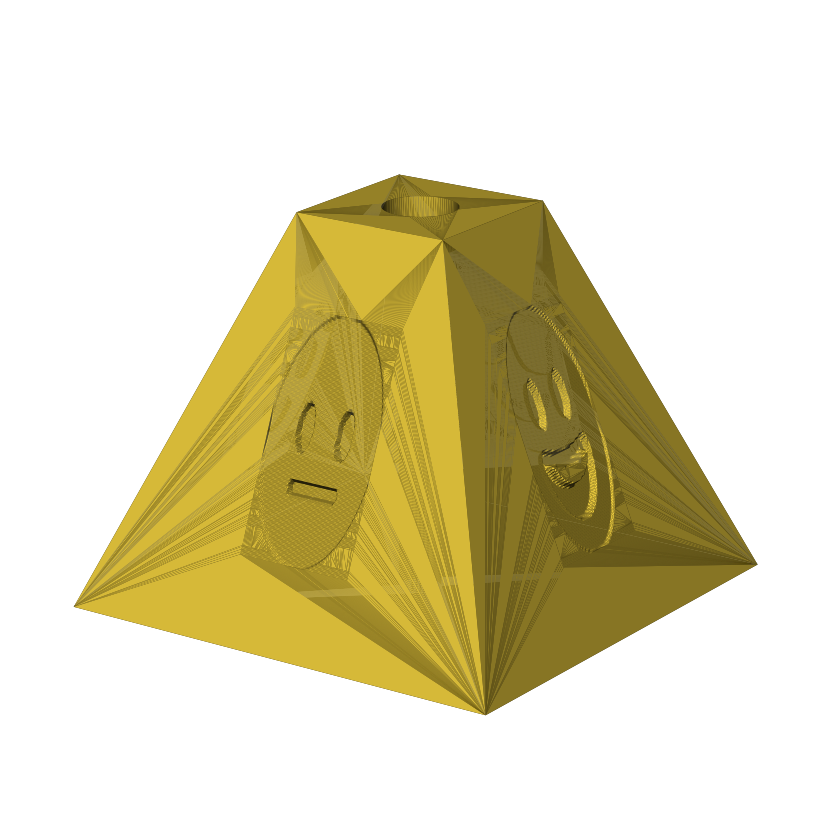

# piramide-emoji

Generador paramétrico de **pirámides truncadas en 3D**, listas para imprimir,
con:

- Base cuadrada y parte superior truncada (tronco de pirámide).
- Un agujero pasante por el centro para un **tornillo M3** (con alojamiento
  opcional para la cabeza, tipo avellanado/counterbore, en la cara superior).
- Un **emoji grabado** (o repujado) en cada una de las caras laterales que
  quieras (la cara inferior nunca lleva grabado).

El resultado se exporta directamente a `.stl`, listo para laminar/imprimir.

<p align="center">
  
  <br><i>Ejemplo generado con <code>examples/carita.yaml</code>.</i>
</p>

## Instalación

Requiere Python 3.9+.

```bash
git clone <este-repo>
cd piramide-emoji
pip install -e ".[yaml]"
```

Dependencias principales: [`trimesh`](https://trimesh.org/) +
[`manifold3d`](https://github.com/elalish/manifold) (booleanas 3D robustas),
`cairosvg` (rasterizar los SVG de los emojis) y `Pillow`/`numpy`.

## Uso rápido

```bash
# El mismo emoji en las 4 caras
piramide-emoji \
  --emoji-front "😀" --emoji-right "😀" --emoji-back "😀" --emoji-left "😀" \
  -o piramide.stl

# Un emoji distinto por cara, a partir de un fichero de configuración
piramide-emoji --config examples/carita.yaml -o piramide.stl
```

Cada emoji se descarga automáticamente (una sola vez, con caché local) del
proyecto [Twemoji](https://github.com/twitter/twemoji) de Twitter/X
(licencia CC-BY 4.0), a partir del propio carácter Unicode que escribas.
También puedes pasar la ruta a un `.svg` o `.png` propio en vez de un emoji,
para usar tu propio dibujo.

## Cómo funciona el grabado

El emoji no se graba como una simple silueta en blanco y negro: se convierte
en un **relieve** (heightmap) a partir de su luminancia, de forma que los
trazos oscuros del dibujo (ojos, boca, contornos...) quedan grabados más
profundos y el resto queda como una fina huella apenas visible. Ese relieve
se orienta y encaja exactamente sobre el plano de la cara elegida (aunque
esté inclinada, como en un tronco de pirámide) y se resta (o se une, en modo
`--emboss`) del sólido mediante una operación booleana 3D robusta.

## Parámetros de la pirámide

| Opción | Descripción | Por defecto |
|---|---|---|
| `--base-size` | Lado de la base cuadrada (mm) | 40 |
| `--top-size` | Lado de la cara superior truncada (mm) | 14 |
| `--height` | Altura total (mm) | 32 |
| `--screw-hole-diameter` | Diámetro de paso del agujero (mm); 3.4 = M3 con holgura | 3.4 |
| `--screw-head-diameter` | Diámetro del alojamiento de la cabeza del tornillo (mm) | 6.2 |
| `--screw-head-depth` | Profundidad del alojamiento de la cabeza (mm) | 3.2 |
| `--no-hole` | No generar el agujero del tornillo | — |

## Parámetros del grabado de emojis

| Opción | Descripción | Por defecto |
|---|---|---|
| `--emoji-front/right/back/left` | Emoji (o ruta a SVG/PNG) para cada cara | — |
| `--depth` | Profundidad (o altura, en emboss) máxima del grabado (mm) | 1.0 |
| `--emoji-scale` | Escala del emoji respecto al área utilizable de la cara (0–1] | 1.0 |
| `--emboss` | Repuja el emoji en vez de grabarlo | grabado |
| `--resolution` | Resolución de la rejilla del relieve (más = más detalle, más lento) | 96 |
| `--invert` | Invierte qué zonas del emoji quedan "activas" | — |

## Configuración con fichero (YAML/JSON)

Para tener control fino por cada cara (emoji, profundidad, escala...) usa
`--config archivo.yaml`, ver [`examples/carita.yaml`](examples/carita.yaml):

```yaml
pyramid:
  base_size: 40.0
  top_size: 14.0
  height: 32.0
  screw_hole_diameter: 3.4
  screw_head_diameter: 6.2
  screw_head_depth: 3.2

faces:
  front:
    emoji: "😐"
    depth: 0.8
    scale: 0.9
  right:
    emoji: "😀"
  back:
    emoji: "😎"
  left:
    emoji: "😉"
```

## Uso como librería Python

```python
from piramide_emoji.geometry import PyramidSpec
from piramide_emoji.engrave import EngraveSpec
from piramide_emoji.builder import PyramidBuild

build = PyramidBuild(
    pyramid=PyramidSpec(base_size=40, top_size=14, height=32),
    faces={
        "front": EngraveSpec(emoji="😀", depth=0.8),
        "right": EngraveSpec(emoji="😎", depth=0.8),
    },
)
build.export("piramide.stl")
```

## Tests

```bash
pip install -e ".[dev]"
pytest -v
```

El repositorio incluye un workflow de GitHub Actions
([`.github/workflows/build.yml`](.github/workflows/build.yml)) que ejecuta
los tests y publica como artefacto un STL de ejemplo en cada push.

## Notas / limitaciones

- El sólido es macizo (no hueco) por dentro, lo que da mucho margen para que
  el grabado del emoji no llegue nunca a tocar el agujero central del
  tornillo. Si necesitas una pieza hueca para ahorrar material, ábrelo como
  incidencia y se puede añadir un modo "shell".
- Con `--resolution` muy alto (>150) y las 4 caras grabadas, el tiempo de
  generación puede subir a varios segundos por cara; 90–120 suele ser un
  buen equilibrio entre detalle y velocidad para imprimir a tamaños de
  30–50 mm de lado.
- Los SVG de Twemoji se descargan de GitHub la primera vez que usas cada
  emoji y se cachean en `~/.cache/piramide_emoji` (configurable con la
  variable de entorno `PIRAMIDE_EMOJI_CACHE`).
